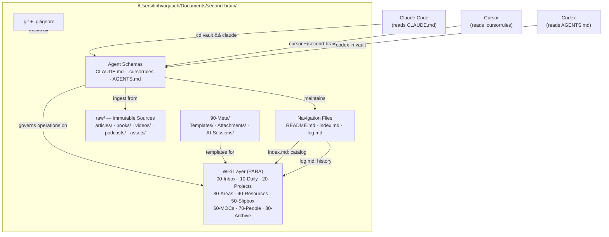

# System Design & Architecture

## Architecture Overview

The vault is a two-layer knowledge system with agent schemas, navigation files, and a git-tracked markdown store.



**Technology stack:**
- Storage: plain Markdown (`.md`) + YAML frontmatter
- Version control: git
- Editor: Obsidian (reads `.obsidian/` config)
- AI agents: Claude Code (reads `CLAUDE.md`), Cursor (reads `.cursorrules`), Codex (reads `AGENTS.md`)

## Data Models

### Frontmatter contract (all non-daily notes)

```yaml
---
created: YYYY-MM-DD
updated: YYYY-MM-DD
type: fleeting | daily | lit | evergreen | project | area | moc | person
tags: [kebab-case-tag]
status: seedling | budding | evergreen
source: "[[lit-note-title]]"   # optional
related: ["[[note-title]]"]    # optional
---
```

### index.md structure

```markdown
# Vault Index
_Last updated: YYYY-MM-DD_

## Sources (40-Resources/learning/)
- [[filename]] — one-line summary

## Concepts (50-Slipbox/)
- [[filename]] — one-line summary

## MOCs (60-MOCs/)
- [[filename]] — one-line summary

## Projects (20-Projects/)
- [[filename]] — one-line summary

## Areas (30-Areas/)
- [[filename]] — one-line summary

## People (70-People/)
- [[filename]] — one-line summary
```

### log.md structure

```markdown
# Vault Activity Log

## [YYYY-MM-DD] init | Vault Day 1 setup
Initialized vault skeleton, agent schemas, templates, and git.
```

Each entry: `## [YYYY-MM-DD] <operation> | <title>` — parseable with `grep "^## \["`.

## API Design

N/A — no external APIs. Agents interact with the vault via filesystem reads/writes governed by the schema files.

**Agent interface contracts:**

| Agent | Schema file | Entry point | Key instructions |
|---|---|---|---|
| Claude Code | `CLAUDE.md` | `cd /Users/linhvuquach/Documents/second-brain && claude` | Ingest workflow, index.md/log.md maintenance, folder map |
| Cursor | `.cursorrules` | `cursor /Users/linhvuquach/Documents/second-brain` | Same conventions, `@index.md` before queries |
| Codex | `AGENTS.md` | `codex` in vault dir | Same conventions as CLAUDE.md |

## Component Breakdown

### 1. Folder skeleton (15 directories)

| Path | Purpose |
|---|---|
| `raw/articles/` | Clipped web articles (immutable) |
| `raw/books/` | Book exports, highlights (immutable) |
| `raw/videos/` | Video transcripts, notes (immutable) |
| `raw/podcasts/` | Podcast transcripts (immutable) |
| `raw/assets/` | Downloaded images (Obsidian attachment folder) |
| `00-Inbox/` | Unprocessed fleeting captures |
| `10-Daily/` | Daily notes (YYYY-MM-DD.md) |
| `20-Projects/` | Active project folders |
| `30-Areas/area-engineering-craft/` | Engineering craft area |
| `30-Areas/area-health/` | Health area |
| `30-Areas/area-finances/` | Finances area |
| `30-Areas/area-relationships/` | Relationships area |
| `40-Resources/tech/{languages,system-design,snippets,tools}/` | Tech reference |
| `40-Resources/learning/` | Literature notes, course notes |
| `40-Resources/general/` | General reference |
| `50-Slipbox/` | Atomic evergreen notes |
| `60-MOCs/` | Maps of Content |
| `70-People/` | Person notes |
| `80-Archive/` | Inactive/historical |
| `90-Meta/Templates/` | Note templates |
| `90-Meta/Attachments/` | Manual attachments |
| `90-Meta/AI-Sessions/` | Agent session logs |

### 2. Agent schema files

- **`CLAUDE.md`**: Full template from updated `docs/building-a-second-brain.md` Section 4, Pattern B. Includes two-layer model, special files (index.md/log.md), folder map, frontmatter contract, operating rules, ingest workflow, common prompts.
- **`.cursorrules`**: Full template from updated Section 4, Pattern C. Same conventions as CLAUDE.md in Cursor-compatible plain text format.
- **`AGENTS.md`**: Codex (OpenAI) agent schema. Same folder map, frontmatter contract, and ingest workflow as CLAUDE.md. Format: plain markdown with `# AGENTS.md` heading (Codex convention).

### 3. Vault-root navigation files

- **`README.md`**: Human dashboard — folder overview, quick links, what to do on Day 2+.
- **`index.md`**: LLM page catalog seeded with empty category sections. Agent reads this before any non-trivial query.
- **`log.md`**: Append-only log seeded with Day 1 init entry.

### 4. Templates (6 files in `90-Meta/Templates/`)

| Template | Type | Key sections |
|---|---|---|
| `daily-note.md` | daily | AM intent, log, evening review, tomorrow |
| `lit-note.md` | lit | Source metadata, key claims, atomic claim candidates |
| `evergreen-note.md` | evergreen | Frontmatter, claim body, supporting evidence, links |
| `project-note.md` | project | Status, goal, next action, decisions log |
| `weekly-review.md` | meta | 5-step script from Section 5 |
| `ingest-session.md` | meta | Ingest checklist (summary → entity pages → index → log) |

### 5. `_index.md` per top-level folder (10 files)

Each folder's `_index.md` contains: purpose, naming conventions, what belongs here, what doesn't, and a Dataview query stub showing notes by recency:

```dataview
TABLE created, status
FROM "<folder-path>"
SORT created DESC
LIMIT 10
```

The `LIMIT 10` keeps the index readable when the folder grows. Sub-folder conventions are described in the parent `_index.md` — no separate `_index.md` per sub-folder.

### 6. `.gitignore`

```
.obsidian/workspace.json
.obsidian/workspace-mobile.json
.trash/
.DS_Store
```

### 7. `.gitkeep` files

One per empty leaf directory to preserve structure in git.

## Design Decisions

| Decision | Choice | Rationale |
|---|---|---|
| Three schema files vs one | `CLAUDE.md` + `.cursorrules` + `AGENTS.md` | Each agent reads its native format. Same conventions, three agent-native representations. Keeps agent-specific formatting clean. |
| `index.md` at root vs inside wiki folder | Vault root | Agents load it first on any query regardless of working subdirectory |
| `raw/` at top level vs inside `40-Resources/` | Top level | Makes immutability boundary clear; agents won't accidentally modify sources while working on wiki pages |
| Comprehensive templates vs stubs | Comprehensive | Day 2 usable immediately; embedded prompts guide correct usage without reading the full doc |
| `.gitkeep` in empty dirs | Yes | git doesn't track empty directories; structure would be lost in a fresh clone |
| `workspace.json` + `.DS_Store` in `.gitignore` | Yes | `workspace.json` changes every session; `.DS_Store` created by macOS Finder in every visited folder — both create commit noise |
| Dataview query in `_index.md` | `TABLE created, status SORT created DESC LIMIT 10` | Shows what's new in each folder at a glance; recency is the most useful view during daily review |
| `index.md` category coverage | All 6: Sources, Concepts, MOCs, Projects, Areas, People | LLM reads index.md first on every query; missing categories mean person/area notes are invisible to the agent |

## Non-Functional Requirements

- **Idempotent**: re-running creation of any file should be safe (overwrite or skip)
- **Agent-readable**: all schema files use clear section headers; no ambiguous language
- **Obsidian-compatible**: frontmatter uses Obsidian properties format; wikilinks use `[[double-bracket]]`
- **Git-clean**: `.gitignore` ensures first commit is clean; no `.DS_Store` or transient files
