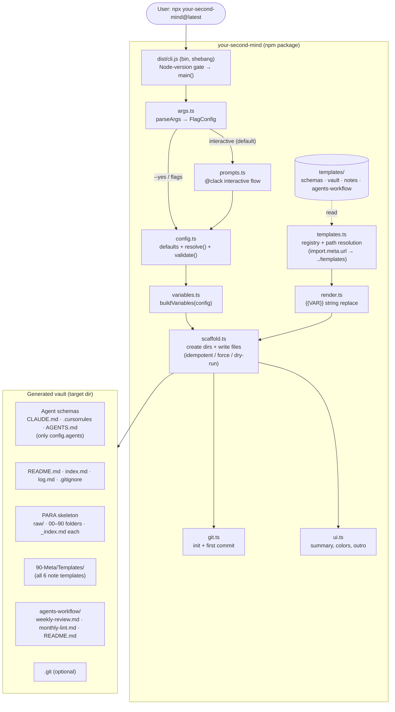

# System Design & Architecture

> **Revision (2026-06-20):** Redesigned for the **npm-package-from-day-one** direction. The
> prior Python `setup.py` + hand-rolled YAML parser design is **dropped**. New stack:
> **TypeScript + ESM**, **Node 20+**, published as **`your-second-mind`** and run via
> `npx your-second-mind@latest`. See the revised requirements doc for locked decisions.
>
> **Locked tech choices:** prompts = `@clack/prompts`; arg parsing = Node built-in
> `node:util parseArgs` (zero-dep); build = `tsup` (esbuild, emits ESM + `.d.ts` + shebang);
> tests = `vitest`; color = `picocolors`.

## Architecture Overview



**User flow:**
1. `npx your-second-mind@latest` (or global install → `your-second-mind`).
2. CLI gates on Node ≥ 20, parses flags.
3. If interactive (default): `@clack` prompts collect answers, defaults pre-filled.
   If `--yes`/flags: resolve config from flags + defaults (no prompts).
4. Config validated → variables built → templates rendered → files written to the target dir
   (idempotent; `--dry-run` previews, `--force` overwrites).
5. Optional `git init` + first commit.
6. Summary printed: created/skipped counts + next steps (open Obsidian, copy a command from
   `agents-workflow/`).

**Technology stack:** Node 20+, TypeScript (ESM), `@clack/prompts`, `node:util` `parseArgs`,
`picocolors`, `tsup` (build), `vitest` (test). Templates are plain Markdown `.tmpl`/`.md`
files shipped alongside the compiled JS.

## Project Structure

```
your-second-mind/
├── package.json            # bin, "type":"module", engines.node>=20, files:[dist, templates]
├── tsconfig.json
├── tsup.config.ts          # entry src/cli.ts → dist/cli.js, format esm, dts, shebang banner
├── vitest.config.ts
├── src/
│   ├── cli.ts              # bin entry: Node-version gate, parse, dispatch, error boundary
│   ├── args.ts             # parseArgs schema + flags → Partial<Config>
│   ├── prompts.ts          # @clack interactive flow + cancel handling
│   ├── config.ts           # Config type, DEFAULTS, resolve(), validate()
│   ├── variables.ts        # buildVariables(config) → Record<string,string>
│   ├── render.ts           # renderTemplate(content, vars)
│   ├── templates.ts        # TEMPLATES_DIR, AGENT_FILES, NOTE_TEMPLATES, FOLDER_META, NAV_FILES
│   ├── scaffold.ts         # createDirs + writeFiles + dry-run tree → ScaffoldResult
│   ├── git.ts              # isGitAvailable(), gitInit()
│   └── ui.ts               # intro/outro, summary, picocolors helpers
├── templates/              # shipped verbatim; resolved at runtime via import.meta.url
│   ├── schemas/{CLAUDE.md.tmpl, cursorrules.tmpl, AGENTS.md.tmpl}
│   ├── vault/{README.md.tmpl, index.md.tmpl, log.md.tmpl, _index.md.tmpl, gitignore.tmpl}
│   ├── notes/{daily-note, lit-note, evergreen-note, project-note, weekly-review, ingest-session}.md.tmpl
│   └── agents-workflow/{weekly-review.md, monthly-lint.md, README.md}
├── test/
│   ├── unit/{render, variables, config, args}.test.ts
│   └── integration/scaffold.test.ts   # writes to a tmp dir, asserts tree + no "{{" leakage
└── dist/                   # tsup output (published, git-ignored)
```

**Template path resolution (critical):** templates are *not* bundled into the JS — they ship
as files via the `files` whitelist and are read at runtime. Resolve relative to the compiled
module, never the CWD:

```ts
import { fileURLToPath } from "node:url";
export const TEMPLATES_DIR = fileURLToPath(new URL("../templates", import.meta.url));
// dist/cli.js → ../templates == <package>/templates
```

## Data Models

### `Config` (resolved, in-memory)

```ts
type Agent = "claude-code" | "cursor" | "codex";

interface Config {
  name: string;                 // required, no default
  role: string;                 // default "software engineer"
  language: string;             // default "English"
  writingStyle: string;         // default "terse, prefer bullets over prose"
  vaultPath: string;            // default "~/Documents/second-brain"; ~ expanded on resolve
  areas: string[];              // default [engineering-craft, career, learning, side-projects]
  rawSources: string[];         // default [articles, books, videos, podcasts, assets]
  agents: Agent[];              // default all three
  obsidianPlugins: { core: string[]; ai: string[]; optional: string[] };
  gitInit: boolean;             // default true
}
// Note templates are NOT in Config — all six are always installed (locked decision).
```

`DEFAULTS` holds every default; `resolve(flags, answers)` layers **defaults ← flag values ←
prompt answers** and expands `~`. `validate(config)` enforces: non-empty `name`, ≥1 area,
≥1 valid agent; throws a typed `ConfigError` with a clear message.

### Template variable map

| Variable | Source | Example |
|---|---|---|
| `{{NAME}}` | `config.name` | `Alice` |
| `{{ROLE}}` | `config.role` | `researcher` |
| `{{LANGUAGE}}` | `config.language` | `English` |
| `{{WRITING_STYLE}}` | `config.writingStyle` | `terse, prefer bullets` |
| `{{VAULT_PATH}}` | expanded `config.vaultPath` | `/Users/alice/second-brain` |
| `{{AREAS_LIST}}` | `config.areas` → bullets | `- area-research\n- area-teaching` |
| `{{AREAS_FOLDERS}}` | `config.areas` → folder paths | `30-Areas/area-research/` … |
| `{{RAW_SOURCES_LIST}}` | `config.rawSources` | `raw/papers/, raw/datasets/` |
| `{{AGENTS_USED}}` | `config.agents` → display names | `Claude Code, Cursor` |
| `{{DATE}}` | runtime date (CLI start) | `2026-06-20` |
| `{{FOLDER_NAME}}` / `{{FOLDER_PATH}}` | per `_index.md` render | `50-Slipbox` |
| `{{FOLDER_PURPOSE}}` / `{{FOLDER_AGENT_INSTRUCTION}}` | `FOLDER_META` lookup | … |
| `{{PLUGINS_CORE}}` / `{{PLUGINS_AI}}` | `config.obsidianPlugins.*` | `- Periodic Notes` … |

`{{DATE}}` is captured **once** at CLI start (`new Date()`), passed through — not re-read per file.

### `FOLDER_META` (constant in `templates.ts`)

Same 10-folder semantic map as before (`00-Inbox` … `90-Meta`), each `→ [purpose,
agentInstruction]`, used to render one `_index.md` per top-level folder. (Carried over
verbatim from the prior design — unchanged by the stack pivot.)

## API / CLI Interface

```
your-second-mind [options]
```

| Flag | Default | Behavior |
|---|---|---|
| (none) | — | Interactive prompts (default mode) |
| `--yes`, `-y` | off | Non-interactive: use defaults for unprovided answers (`--name` still required) |
| `--name <s>` | — | Set name (required when `--yes` and not prompting) |
| `--role <s>` | default | Set role |
| `--vault-path <p>` | default | Target vault directory |
| `--areas <a,b>` | default | Comma-separated areas |
| `--raw-sources <a,b>` | default | Comma-separated raw source types |
| `--agents <a,b>` | all | Comma-separated subset of `claude-code,cursor,codex` |
| `--no-git` | git on | Skip git init |
| `--dry-run` | off | Print file tree; write nothing |
| `--force` | off | Overwrite existing files |
| `--help`, `--version` | — | Standard |

Exit codes: `0` success; `1` error / validation failure / user cancel (Ctrl-C). Errors go to
stderr with a one-line clear message. `--config <file>` is **not** in v1 (deferred to v2).

## Component Breakdown

1. **`cli.ts`** — `main()`: (a) gate `process.versions.node` major ≥ 20 → else exit 1 with
   "Node 20+ required"; (b) `parseArgs`; (c) `--help`/`--version`; (d) choose interactive vs
   flag mode; (e) `resolve` → `validate`; (f) `scaffold`; (g) optional `gitInit`; (h)
   summary. Wraps everything in a try/catch that maps `ConfigError`/cancel to clean exits.

2. **`args.ts`** — declares the `parseArgs` `options` object (booleans/strings above), maps
   parsed values to a `Partial<Config>` + run flags (`yes`, `dryRun`, `force`, `noGit`).
   Comma-splits list flags. Unknown flag → error.

3. **`prompts.ts`** — `@clack` `intro` → grouped prompts (text, multiselect for agents/areas,
   confirm for git) with defaults pre-filled; `isCancel` on every prompt → graceful exit 1.
   Returns `Partial<Config>` (answers only). Skipped entirely when `--yes`.

4. **`config.ts`** — `DEFAULTS`, `resolve(flags, answers)` (layering + `~` expansion via
   `os.homedir()`), `validate()`. Pure, fully unit-testable.

5. **`variables.ts`** — `buildVariables(config, date)` → `Record<string,string>` for all
   non-per-folder variables; per-folder vars injected during `_index.md` render.

6. **`render.ts`** — `renderTemplate(content, vars)`: `for (k,v) content = content.replaceAll("{{"+k+"}}", v)`.
   Leaves unknown `{{X}}` intact (caught by the integration test's no-leak assertion).

7. **`templates.ts`** — `TEMPLATES_DIR`; `AGENT_FILES` (`agent → [destName, tmplRelPath]`);
   `NOTE_TEMPLATES` (all six); `NAV_FILES`; `FOLDER_META`; `COMMAND_FILES` (the two
   `agents-workflow` commands + its README). Read helpers return file contents.

8. **`scaffold.ts`** — `scaffold(config, vars, {force, dryRun})`:
   - create PARA dirs, `area-<x>/`, `raw/<src>/`, `90-Meta/*`, `agents-workflow/`
   - write agent schemas for `config.agents` only
   - write nav files, one `_index.md` per folder (per-folder vars), all six note templates
   - copy `agents-workflow/{weekly-review.md, monthly-lint.md, README.md}` **verbatim** (no
     render — they carry `$CURRENT_DATE`/`$ARGUMENTS` runtime vars that must survive)
   - `.gitkeep` in empty leaf dirs
   - per file: `[create]` / `[skip]` / `[overwrite]`; returns `ScaffoldResult {created, skipped, overwritten, tree}`
   - `dryRun` → build the tree, write nothing

9. **`git.ts`** — `isGitAvailable()` (spawn `git --version`); `gitInit(vaultPath, msg)`
   (`init`, `add .`, `commit`). Missing git → non-fatal warning, skip.

10. **`ui.ts`** — `picocolors`-based status lines, `@clack` `outro` with the summary and
    next-steps (open Obsidian; copy a command from `agents-workflow/` per its README).

## Design Decisions

| Decision | Choice | Rationale |
|---|---|---|
| Runtime/stack | TypeScript + ESM, Node 20+ | Modern tooling; type-safe CLI; matches the npm-from-day-one direction |
| Prompts | `@clack/prompts` | Polished multi-step UX, ESM-native, tiny, built-in cancel handling |
| Arg parsing | `node:util parseArgs` | Zero-dep; flat flag set needs nothing heavier; honors "minimal deps" |
| Build | `tsup` | esbuild speed, near-zero config, ESM + `.d.ts` + shebang banner for the bin |
| Tests | `vitest` | ESM/TS-native, tmp-dir + snapshot friendly for filesystem assertions |
| Template delivery | Files in `templates/`, resolved via `import.meta.url` | Diffable, reusable, not inlined into JS; works from any CWD |
| Commands copied verbatim | No `{{VAR}}` render on `agents-workflow/*` | They use agent-runtime `$CURRENT_DATE`/`$ARGUMENTS` that must not be substituted |
| All 6 note templates always | No template-selection prompt | Guarantees `weekly-review` command's template dependency; simpler config |
| Idempotent by default | Skip existing; `--force` to overwrite | No accidental data loss; re-runnable |
| `{{DATE}}` captured once | Single `new Date()` at start | Deterministic across all files in one run |
| `--config` deferred | v1 = prompts + flags + `--yes` | Smaller v1 surface; modular `resolve()` leaves a clean seam for v2 |
| Pure core (config/render/vars) | Side-effect-free functions | Unit-testable without touching the filesystem |

## Non-Functional Requirements

- **Minimal supply chain:** runtime deps limited to `@clack/prompts` + `picocolors`
  (arg parsing/build/test are built-in or dev-only).
- **Idempotent & safe:** never overwrites without `--force`; never writes outside the target dir.
- **Transparent:** `--dry-run` shows the exact tree before any write.
- **Portable templates:** `.tmpl`/`.md` files readable in any editor; command files survive copy.
- **Fast:** full scaffold < 2s on a warm disk.
- **Personalization-complete:** zero personal references / zero `{{` leakage in output
  (enforced by an integration test).
- **Cross-platform best-effort:** macOS/Linux tested; Windows via Node `path`/`os` (not gated in v1).

## Open Items (design-level)

- **Date injection for tests:** `buildVariables` takes an injectable `date` arg so tests are
  deterministic (avoid hidden `new Date()` inside pure code).
- **`agents-workflow/README.md` content:** finalize the per-agent copy instructions
  (Claude Code, Cursor, Codex, generic).
- **npm name/scope + license:** confirm `your-second-mind` availability and license (MIT assumed).
